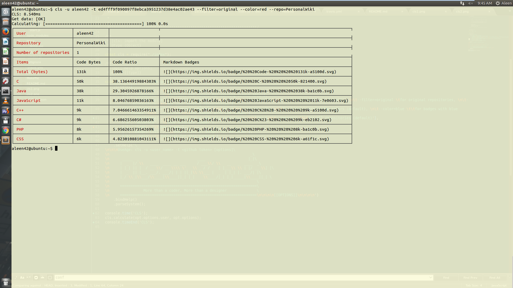

## CLS(Command Lines Statistic for GitHub)

[](https://gitter.im/aleen42/CLS?utm_source=badge&utm_medium=badge&utm_campaign=pr-badge&utm_content=badge)

[](#) [](https://github.com/aleen42/CLS/issues) [](https://raw.githubusercontent.com/aleen42/CLS/master/LICENSE) [](https://gitter.im/aleen42/CLS?utm_source=badge&utm_medium=badge&utm_campaign=pr-badge) 

[](https://www.npmjs.com/package/cls-cli) [](https://travis-ci.org/aleen42/CLS) [](https://david-dm.org/aleen42/CLS#info=devDependencies) [](https://www.npmjs.com/package/cls-cli)

A command tool for Code Statistic of GitHub repositories in **Linux** and **Mac OS**. The main advantage of this tool is that it can access remote repositories without fetching them to local space.

### Code Statistic from GitHub projects (bytes)


### Code Statistic from GitHub projects (lines)




### Installation

	sudo npm install -g cls-cli

### Uninstallation

	sudo npm rm -g cls-cli

### Usage

generate your own github api token following the [site](https://github.com/blog/1509-personal-api-tokens).

then run the command line tool with this token xxx you just generated:

```bash
cls -u aleen42 -t xxx

# tutorial
cls -h
```

*Notice that: if you want to have a statistic for code lines, the process will take a long time, because it should connect to remote directory and the speed should depend on your network status and the size of the repository. By the way, there is a bug when your try to have a statistic for a huge repository, which will cause 504 Gate Way timeout error of svn.*

### Tests

    npm test

### Release History

* ==================== **1.0.0 Initial release** ====================
	* 1.0.0 initial release
	* 1.0.1 update readme
	* 1.0.2 update readme
	* 1.0.3 unused version
	* 1.0.4 unused version
	* 1.0.5 fix bugs
	* 1.0.6 unused version
	* 1.0.7 update test case
	* 1.0.8 update readme
	* 1.0.9 update readme
	* 1.1.0 change lines to bytes
	* 1.1.1 update readme
	* 1.1.2 fix bugs
	* 1.1.3 unused version
	* 1.1.3 test version
* ==================== **2.0.0 Release statistic for lines** ====================
	* 2.0.1 update readme
	* 2.0.2 update readme
	* 2.0.3 update readme
	* 2.0.4 unused version
	* 2.0.5 unused version
	* 2.0.6 unused version
	* 2.0.7 unused version
	* 2.0.8 unused version
	* 2.0.9 unused version
	* 2.1.0 unused version
	* 2.1.1 unused version
	* 2.1.2 unused version
	* 2.1.3 unused version
	* 2.1.4 fix bugs
	* 2.1.5 fix bugs
	* 2.1.6 update readme
	* 2.1.7 update readme
	* 2.1.8 update readme
	* 2.1.9 update readme
	* 2.2.0 update readme

### :fuelpump: How to contribute

Have an idea? Found a bug? See [how to contribute](https://aleen42.gitbooks.io/personalwiki/content/contribution.html).

### :scroll: License

[MIT](https://aleen42.gitbooks.io/personalwiki/content/MIT.html) © aleen42
