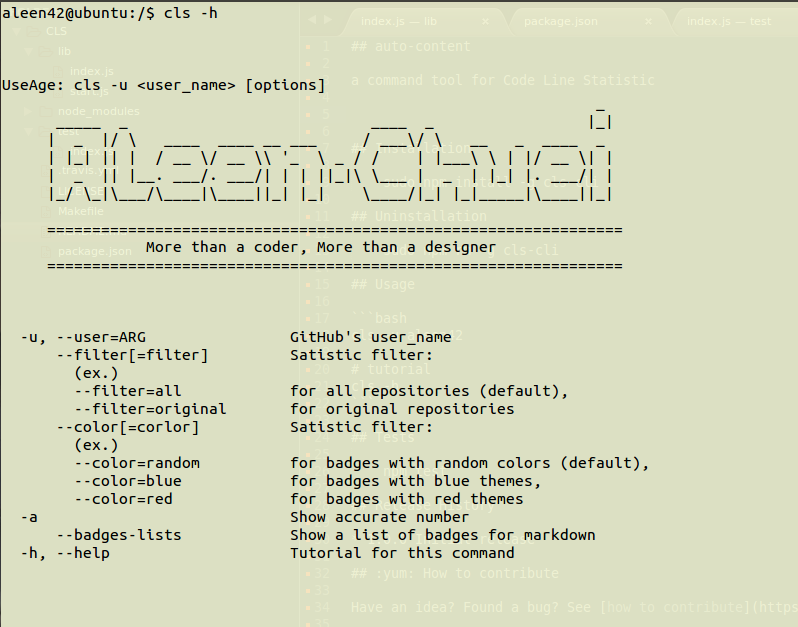
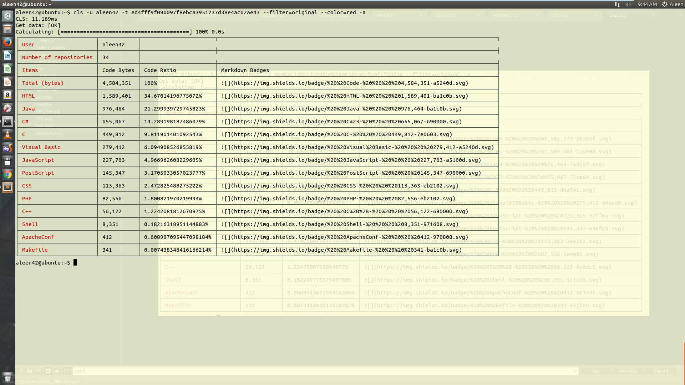

## auto-content

a command tool for Code Line Statistic





## Installation

	sudo npm install -g cls-cli

## Uninstallation

	sudo npm rm -g cls-cli

## Usage

```bash
cls -u aleen42

# tutorial
cls -h
```

## Tests

    npm test

## Release History

* ==================== **1.0.0 Initial release** ====================
	* 1.0.0 Initial release
	* 1.0.1 Update readme
	* 1.0.2 Update readme

## :yum: How to contribute

Have an idea? Found a bug? See [how to contribute](https://aleen42.gitbooks.io/personalwiki/content/contribution.html).

## :scroll: License

[MIT](https://aleen42.gitbooks.io/personalwiki/content/MIT.html) © aleen42
